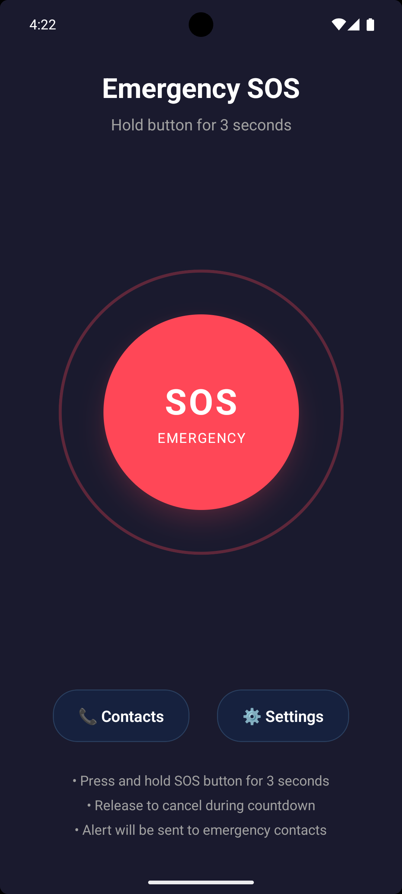
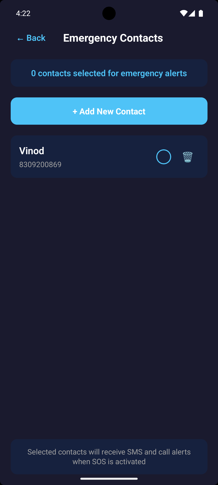

# 🚨 SOS App – React Native CLI

A **simple emergency app** built using **React Native CLI**. With just **one tap**, the app instantly sends an SOS message to a list of predefined contacts, including the user's **current GPS location**. Designed for fast, offline-friendly, real-time alerts during emergencies.

---

## 🧠 Use Case

In real-life emergency situations — such as medical distress, accidents, threats, or natural disasters — users may not have time to call or type. The **SOS App** provides a **single-tap interface** to silently send out help requests via SMS with live location to trusted contacts.

This can help:
- Elderly individuals living alone
- Women and children for personal safety
- Hikers, travelers, or people in remote areas
- Medical patients with conditions requiring quick alerts

---

## 📱 Features

| Feature                         | Description |
|----------------------------------|-------------|
| 🆘 **One-Tap SOS Button**       | Sends an SOS message immediately on tap |
| 📍 **Live Location Sharing**    | Attaches a Google Maps link with GPS coordinates |
| 👥 **Emergency Contacts List**  | Displays hardcoded contacts (can be dynamic later) |
| 📤 **Silent SMS Sending**       | Sends messages silently in the background (Android only) |
| 🎨 **Modern UI**                | Clean, minimal design optimized for quick interaction |

---

## 📸 Screenshots

### 🆘 Home Screen

### ✅ Contacts Adding

---

## ⚙️ Tech Stack

The SOS App is built with the following technologies:

### 🧱 Core Framework
- **React Native CLI** – For building native mobile apps using JavaScript

### 📦 Libraries & Modules

| Library                        | Purpose |
|-------------------------------|---------|
| `react-native-direct-sms`     | Sends SMS directly from the app without opening the default SMS composer (Android only) |
| `@react-native-community/geolocation` | Retrieves real-time GPS location for attaching to SOS messages |
| `react-native-sqlite-storage` | Stores emergency contacts locally using SQLite database |
| `PermissionsAndroid` (React Native API) | Handles runtime permissions for SMS and location access |

---

